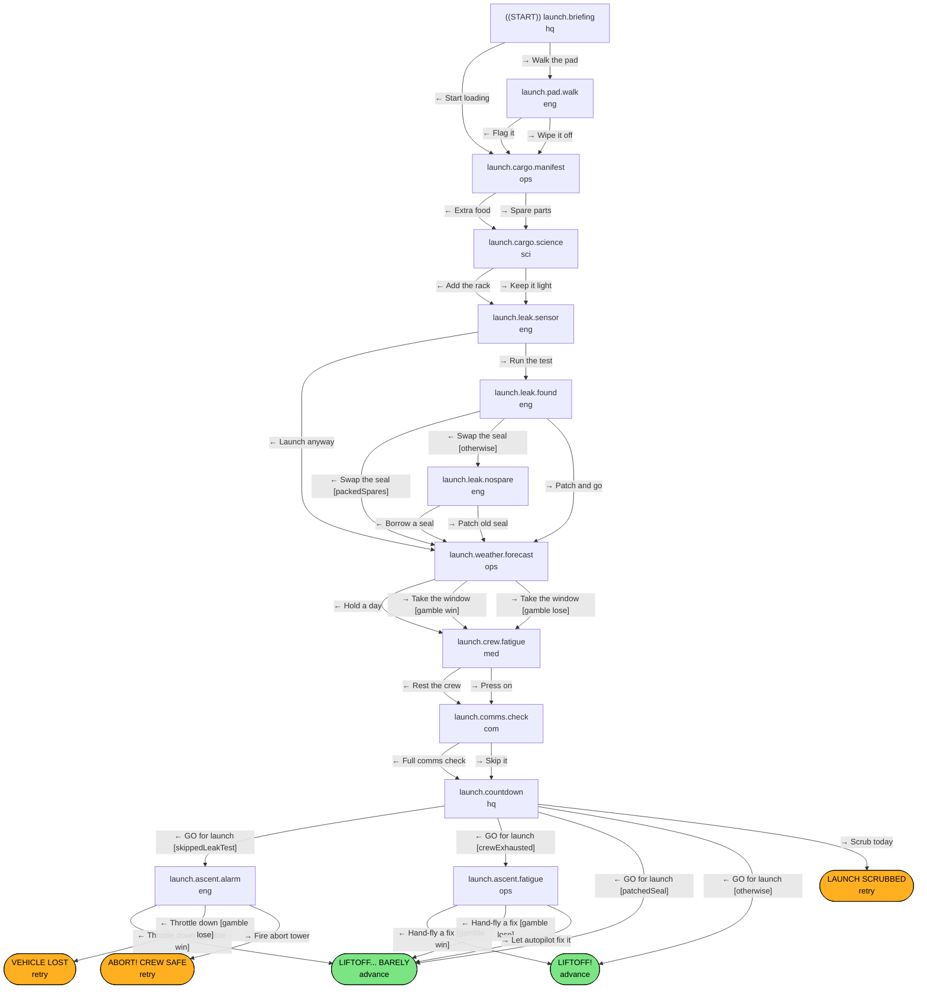

# Launch Day (`ch0-launch-day`)

> Load the ship correctly and lift off.

Worlds: moon, mars

```mermaid
flowchart TD
  n_launch_ascent_alarm["launch.ascent.alarm<br/>eng"]
  n_launch_ascent_fatigue["launch.ascent.fatigue<br/>ops"]
  n_launch_briefing["((START)) launch.briefing<br/>hq"]
  n_launch_pad_walk["launch.pad.walk<br/>eng"]
  n_launch_cargo_manifest["launch.cargo.manifest<br/>ops"]
  n_launch_cargo_science["launch.cargo.science<br/>sci"]
  n_launch_comms_check["launch.comms.check<br/>com"]
  n_launch_countdown["launch.countdown<br/>hq"]
  n_launch_crew_fatigue["launch.crew.fatigue<br/>med"]
  n_launch_leak_sensor["launch.leak.sensor<br/>eng"]
  n_launch_leak_found["launch.leak.found<br/>eng"]
  n_launch_leak_nospare["launch.leak.nospare<br/>eng"]
  n_launch_weather_forecast["launch.weather.forecast<br/>ops"]
  n_launch_liftoff(["LIFTOFF!<br/>advance"]):::advance
  n_launch_damaged(["LIFTOFF... BARELY<br/>advance"]):::advance
  n_launch_scrubbed(["LAUNCH SCRUBBED<br/>retry"]):::retry
  n_launch_abort(["ABORT! CREW SAFE<br/>retry"]):::retry
  n_launch_explosion(["VEHICLE LOST<br/>retry"]):::retry
  n_launch_ascent_alarm -->|"← Throttle down [gamble win]"| n_launch_damaged
  n_launch_ascent_alarm -->|"← Throttle down [gamble lose]"| n_launch_explosion
  n_launch_ascent_alarm -->|"→ Fire abort tower"| n_launch_abort
  n_launch_ascent_fatigue -->|"← Hand-fly a fix [gamble win]"| n_launch_liftoff
  n_launch_ascent_fatigue -->|"← Hand-fly a fix [gamble lose]"| n_launch_damaged
  n_launch_ascent_fatigue -->|"→ Let autopilot fix it"| n_launch_damaged
  n_launch_briefing -->|"← Start loading"| n_launch_cargo_manifest
  n_launch_briefing -->|"→ Walk the pad"| n_launch_pad_walk
  n_launch_pad_walk -->|"← Flag it"| n_launch_cargo_manifest
  n_launch_pad_walk -->|"→ Wipe it off"| n_launch_cargo_manifest
  n_launch_cargo_manifest -->|"← Extra food"| n_launch_cargo_science
  n_launch_cargo_manifest -->|"→ Spare parts"| n_launch_cargo_science
  n_launch_cargo_science -->|"← Add the rack"| n_launch_leak_sensor
  n_launch_cargo_science -->|"→ Keep it light"| n_launch_leak_sensor
  n_launch_comms_check -->|"← Full comms check"| n_launch_countdown
  n_launch_comms_check -->|"→ Skip it"| n_launch_countdown
  n_launch_countdown -->|"← GO for launch [skippedLeakTest]"| n_launch_ascent_alarm
  n_launch_countdown -->|"← GO for launch [crewExhausted]"| n_launch_ascent_fatigue
  n_launch_countdown -->|"← GO for launch [patchedSeal]"| n_launch_damaged
  n_launch_countdown -->|"← GO for launch [otherwise]"| n_launch_liftoff
  n_launch_countdown -->|"→ Scrub today"| n_launch_scrubbed
  n_launch_crew_fatigue -->|"← Rest the crew"| n_launch_comms_check
  n_launch_crew_fatigue -->|"→ Press on"| n_launch_comms_check
  n_launch_leak_sensor -->|"← Launch anyway"| n_launch_weather_forecast
  n_launch_leak_sensor -->|"→ Run the test"| n_launch_leak_found
  n_launch_leak_found -->|"← Swap the seal [packedSpares]"| n_launch_weather_forecast
  n_launch_leak_found -->|"← Swap the seal [otherwise]"| n_launch_leak_nospare
  n_launch_leak_found -->|"→ Patch and go"| n_launch_weather_forecast
  n_launch_leak_nospare -->|"← Borrow a seal"| n_launch_weather_forecast
  n_launch_leak_nospare -->|"→ Patch old seal"| n_launch_weather_forecast
  n_launch_weather_forecast -->|"← Hold a day"| n_launch_crew_fatigue
  n_launch_weather_forecast -->|"→ Take the window [gamble win]"| n_launch_crew_fatigue
  n_launch_weather_forecast -->|"→ Take the window [gamble lose]"| n_launch_crew_fatigue
  classDef advance fill:#7ae582,stroke:#000,color:#000;
  classDef retry fill:#ffb020,stroke:#000,color:#000;
  classDef mission fill:#4cc9f0,stroke:#000,color:#000;
```
