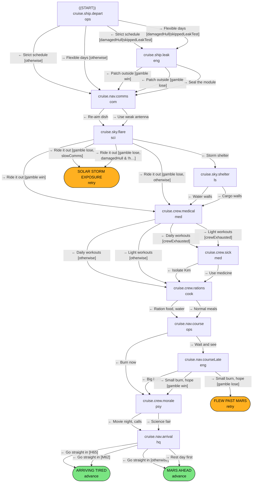

# The Long Cruise (`mars-ch1-long-cruise`)

> Keep the crew healthy and on course through seven months of deep space.

Worlds: mars

```mermaid
flowchart TD
  n_cruise_crew_medical["cruise.crew.medical<br/>med"]
  n_cruise_crew_sick["cruise.crew.sick<br/>med"]
  n_cruise_crew_rations["cruise.crew.rations<br/>cook"]
  n_cruise_crew_morale["cruise.crew.morale<br/>psy"]
  n_cruise_nav_comms["cruise.nav.comms<br/>com"]
  n_cruise_nav_course["cruise.nav.course<br/>ops"]
  n_cruise_nav_courseLate["cruise.nav.courseLate<br/>eng"]
  n_cruise_nav_arrival["cruise.nav.arrival<br/>hq"]
  n_cruise_ship_depart["((START)) cruise.ship.depart<br/>ops"]
  n_cruise_ship_leak["cruise.ship.leak<br/>eng"]
  n_cruise_sky_flare["cruise.sky.flare<br/>sci"]
  n_cruise_sky_shelter["cruise.sky.shelter<br/>ls"]
  n_cruise_smooth(["MARS AHEAD<br/>advance"]):::advance
  n_cruise_strained(["ARRIVING TIRED<br/>advance"]):::advance
  n_cruise_radiation(["SOLAR STORM EXPOSURE<br/>retry"]):::retry
  n_cruise_missed(["FLEW PAST MARS<br/>retry"]):::retry
  n_cruise_crew_medical -->|"← Daily workouts [crewExhausted]"| n_cruise_crew_sick
  n_cruise_crew_medical -->|"← Daily workouts [otherwise]"| n_cruise_crew_rations
  n_cruise_crew_medical -->|"→ Light workouts [crewExhausted]"| n_cruise_crew_sick
  n_cruise_crew_medical -->|"→ Light workouts [otherwise]"| n_cruise_crew_rations
  n_cruise_crew_sick -->|"← Isolate Kim"| n_cruise_crew_rations
  n_cruise_crew_sick -->|"→ Use medicine"| n_cruise_crew_rations
  n_cruise_crew_rations -->|"← Ration food, water"| n_cruise_nav_course
  n_cruise_crew_rations -->|"→ Normal meals"| n_cruise_nav_course
  n_cruise_crew_morale -->|"← Movie night, calls"| n_cruise_nav_arrival
  n_cruise_crew_morale -->|"→ Science fair"| n_cruise_nav_arrival
  n_cruise_nav_comms -->|"← Re-aim dish"| n_cruise_sky_flare
  n_cruise_nav_comms -->|"→ Use weak antenna"| n_cruise_sky_flare
  n_cruise_nav_course -->|"← Burn now"| n_cruise_crew_morale
  n_cruise_nav_course -->|"→ Wait and see"| n_cruise_nav_courseLate
  n_cruise_nav_courseLate -->|"← Big burn"| n_cruise_crew_morale
  n_cruise_nav_courseLate -->|"→ Small burn, hope [gamble win]"| n_cruise_crew_morale
  n_cruise_nav_courseLate -->|"→ Small burn, hope [gamble lose]"| n_cruise_missed
  n_cruise_nav_arrival -->|"← Go straight in [H65]"| n_cruise_strained
  n_cruise_nav_arrival -->|"← Go straight in [M62]"| n_cruise_strained
  n_cruise_nav_arrival -->|"← Go straight in [otherwise]"| n_cruise_smooth
  n_cruise_nav_arrival -->|"→ Rest day first"| n_cruise_smooth
  n_cruise_ship_depart -->|"← Strict schedule [damagedHull|skippedLeakTest]"| n_cruise_ship_leak
  n_cruise_ship_depart -->|"← Strict schedule [otherwise]"| n_cruise_nav_comms
  n_cruise_ship_depart -->|"→ Flexible days [damagedHull|skippedLeakTest]"| n_cruise_ship_leak
  n_cruise_ship_depart -->|"→ Flexible days [otherwise]"| n_cruise_nav_comms
  n_cruise_ship_leak -->|"← Patch outside [gamble win]"| n_cruise_nav_comms
  n_cruise_ship_leak -->|"← Patch outside [gamble lose]"| n_cruise_nav_comms
  n_cruise_ship_leak -->|"→ Seal the module"| n_cruise_nav_comms
  n_cruise_sky_flare -->|"← Storm shelter"| n_cruise_sky_shelter
  n_cruise_sky_flare -->|"→ Ride it out [gamble win]"| n_cruise_crew_medical
  n_cruise_sky_flare -->|"→ Ride it out [gamble lose, slowComms]"| n_cruise_radiation
  n_cruise_sky_flare -->|"→ Ride it out [gamble lose, damagedHull & !h…]"| n_cruise_radiation
  n_cruise_sky_flare -->|"→ Ride it out [gamble lose, otherwise]"| n_cruise_crew_medical
  n_cruise_sky_shelter -->|"← Water walls"| n_cruise_crew_medical
  n_cruise_sky_shelter -->|"→ Cargo walls"| n_cruise_crew_medical
  classDef advance fill:#7ae582,stroke:#000,color:#000;
  classDef retry fill:#ffb020,stroke:#000,color:#000;
  classDef mission fill:#4cc9f0,stroke:#000,color:#000;
```
