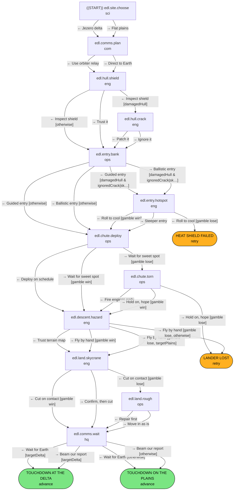

# Seven Minutes of Terror (`mars-ch2-seven-minutes`)

> Survive entry, descent and landing on Mars.

Worlds: mars

```mermaid
flowchart TD
  n_edl_chute_deploy["edl.chute.deploy<br/>ops"]
  n_edl_chute_torn["edl.chute.torn<br/>ops"]
  n_edl_comms_plan["edl.comms.plan<br/>com"]
  n_edl_comms_wait["edl.comms.wait<br/>hq"]
  n_edl_descent_hazard["edl.descent.hazard<br/>eng"]
  n_edl_entry_bank["edl.entry.bank<br/>ops"]
  n_edl_entry_hotspot["edl.entry.hotspot<br/>eng"]
  n_edl_hull_shield["edl.hull.shield<br/>eng"]
  n_edl_hull_crack["edl.hull.crack<br/>eng"]
  n_edl_land_skycrane["edl.land.skycrane<br/>eng"]
  n_edl_land_rough["edl.land.rough<br/>ops"]
  n_edl_site_choose["((START)) edl.site.choose<br/>sci"]
  n_edl_delta(["TOUCHDOWN AT THE DELTA<br/>advance"]):::advance
  n_edl_plains(["TOUCHDOWN ON THE PLAINS<br/>advance"]):::advance
  n_edl_crash(["LANDER LOST<br/>retry"]):::retry
  n_edl_burnthrough(["HEAT SHIELD FAILED<br/>retry"]):::retry
  n_edl_chute_deploy -->|"← Deploy on schedule"| n_edl_descent_hazard
  n_edl_chute_deploy -->|"→ Wait for sweet spot [gamble win]"| n_edl_descent_hazard
  n_edl_chute_deploy -->|"→ Wait for sweet spot [gamble lose]"| n_edl_chute_torn
  n_edl_chute_torn -->|"← Fire engines early"| n_edl_descent_hazard
  n_edl_chute_torn -->|"→ Hold on, hope [gamble win]"| n_edl_descent_hazard
  n_edl_chute_torn -->|"→ Hold on, hope [gamble lose]"| n_edl_crash
  n_edl_comms_plan -->|"← Use orbiter relay"| n_edl_hull_shield
  n_edl_comms_plan -->|"→ Direct to Earth"| n_edl_hull_shield
  n_edl_comms_wait -->|"← Wait for Earth [targetDelta]"| n_edl_delta
  n_edl_comms_wait -->|"← Wait for Earth [otherwise]"| n_edl_plains
  n_edl_comms_wait -->|"→ Beam our report [targetDelta]"| n_edl_delta
  n_edl_comms_wait -->|"→ Beam our report [otherwise]"| n_edl_plains
  n_edl_descent_hazard -->|"← Trust terrain map"| n_edl_land_skycrane
  n_edl_descent_hazard -->|"→ Fly by hand [gamble win]"| n_edl_land_skycrane
  n_edl_descent_hazard -->|"→ Fly by hand [gamble lose, targetPlains]"| n_edl_land_skycrane
  n_edl_descent_hazard -->|"→ Fly by hand [gamble lose, otherwise]"| n_edl_crash
  n_edl_entry_bank -->|"← Guided entry [damagedHull & ignoredCrack|sk…]"| n_edl_entry_hotspot
  n_edl_entry_bank -->|"← Guided entry [otherwise]"| n_edl_chute_deploy
  n_edl_entry_bank -->|"→ Ballistic entry [damagedHull & ignoredCrack|sk…]"| n_edl_entry_hotspot
  n_edl_entry_bank -->|"→ Ballistic entry [otherwise]"| n_edl_chute_deploy
  n_edl_entry_hotspot -->|"← Roll to cool [gamble win]"| n_edl_chute_deploy
  n_edl_entry_hotspot -->|"← Roll to cool [gamble lose]"| n_edl_burnthrough
  n_edl_entry_hotspot -->|"→ Steeper entry"| n_edl_chute_deploy
  n_edl_hull_shield -->|"← Inspect shield [damagedHull]"| n_edl_hull_crack
  n_edl_hull_shield -->|"← Inspect shield [otherwise]"| n_edl_entry_bank
  n_edl_hull_shield -->|"→ Trust it"| n_edl_entry_bank
  n_edl_hull_crack -->|"← Patch it"| n_edl_entry_bank
  n_edl_hull_crack -->|"→ Ignore it"| n_edl_entry_bank
  n_edl_land_skycrane -->|"← Cut on contact [gamble win]"| n_edl_comms_wait
  n_edl_land_skycrane -->|"← Cut on contact [gamble lose]"| n_edl_land_rough
  n_edl_land_skycrane -->|"→ Confirm, then cut"| n_edl_comms_wait
  n_edl_land_rough -->|"← Repair first"| n_edl_comms_wait
  n_edl_land_rough -->|"→ Move in as is"| n_edl_comms_wait
  n_edl_site_choose -->|"← Jezero delta"| n_edl_comms_plan
  n_edl_site_choose -->|"→ Flat plains"| n_edl_comms_plan
  classDef advance fill:#7ae582,stroke:#000,color:#000;
  classDef retry fill:#ffb020,stroke:#000,color:#000;
  classDef mission fill:#4cc9f0,stroke:#000,color:#000;
```
