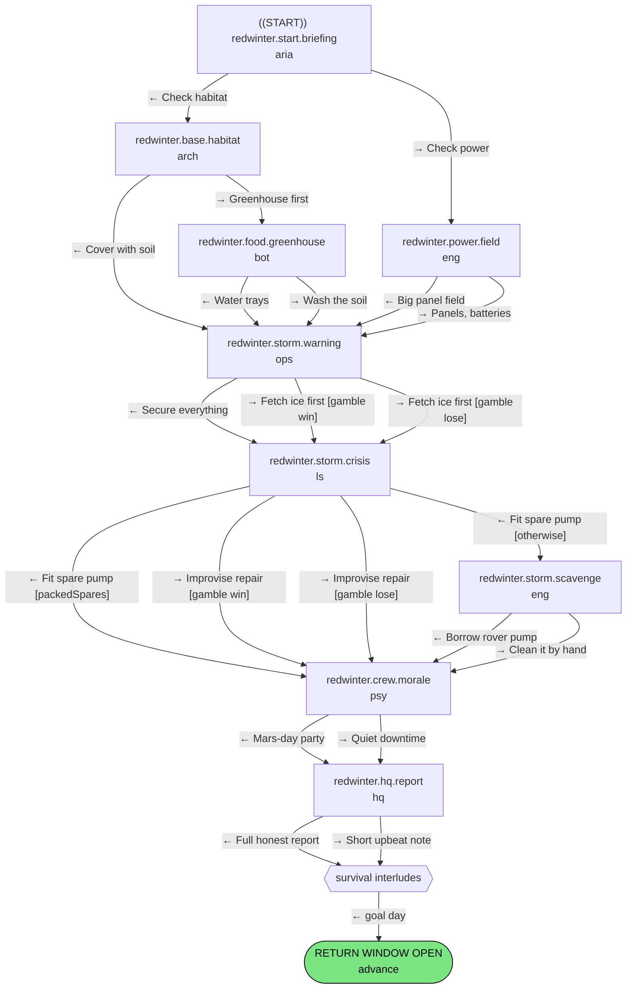

# Red Winter (`mars-ch3-red-winter`)

> Keep the outpost alive until the return window opens on Sol 100.

Worlds: mars

```mermaid
flowchart TD
  n_redwinter_base_habitat["redwinter.base.habitat<br/>arch"]
  n_redwinter_crew_morale["redwinter.crew.morale<br/>psy"]
  n_redwinter_food_greenhouse["redwinter.food.greenhouse<br/>bot"]
  n_redwinter_hq_report["redwinter.hq.report<br/>hq"]
  n_redwinter_power_field["redwinter.power.field<br/>eng"]
  n_redwinter_start_briefing["((START)) redwinter.start.briefing<br/>aria"]
  n_redwinter_storm_warning["redwinter.storm.warning<br/>ops"]
  n_redwinter_storm_crisis["redwinter.storm.crisis<br/>ls"]
  n_redwinter_storm_scavenge["redwinter.storm.scavenge<br/>eng"]
  n_redwinter_complete(["RETURN WINDOW OPEN<br/>advance"]):::advance
  n__interludes{{"survival interludes"}}
  n_redwinter_base_habitat -->|"← Cover with soil"| n_redwinter_storm_warning
  n_redwinter_base_habitat -->|"→ Greenhouse first"| n_redwinter_food_greenhouse
  n_redwinter_crew_morale -->|"← Mars-day party"| n_redwinter_hq_report
  n_redwinter_crew_morale -->|"→ Quiet downtime"| n_redwinter_hq_report
  n_redwinter_food_greenhouse -->|"← Water trays"| n_redwinter_storm_warning
  n_redwinter_food_greenhouse -->|"→ Wash the soil"| n_redwinter_storm_warning
  n_redwinter_hq_report -->|"← Full honest report"| n__interludes
  n_redwinter_hq_report -->|"→ Short upbeat note"| n__interludes
  n_redwinter_power_field -->|"← Big panel field"| n_redwinter_storm_warning
  n_redwinter_power_field -->|"→ Panels, batteries"| n_redwinter_storm_warning
  n_redwinter_start_briefing -->|"← Check habitat"| n_redwinter_base_habitat
  n_redwinter_start_briefing -->|"→ Check power"| n_redwinter_power_field
  n_redwinter_storm_warning -->|"← Secure everything"| n_redwinter_storm_crisis
  n_redwinter_storm_warning -->|"→ Fetch ice first [gamble win]"| n_redwinter_storm_crisis
  n_redwinter_storm_warning -->|"→ Fetch ice first [gamble lose]"| n_redwinter_storm_crisis
  n_redwinter_storm_crisis -->|"← Fit spare pump [packedSpares]"| n_redwinter_crew_morale
  n_redwinter_storm_crisis -->|"← Fit spare pump [otherwise]"| n_redwinter_storm_scavenge
  n_redwinter_storm_crisis -->|"→ Improvise repair [gamble win]"| n_redwinter_crew_morale
  n_redwinter_storm_crisis -->|"→ Improvise repair [gamble lose]"| n_redwinter_crew_morale
  n_redwinter_storm_scavenge -->|"← Borrow rover pump"| n_redwinter_crew_morale
  n_redwinter_storm_scavenge -->|"→ Clean it by hand"| n_redwinter_crew_morale
  n__interludes -->|"← goal day"| n_redwinter_complete
  classDef advance fill:#7ae582,stroke:#000,color:#000;
  classDef retry fill:#ffb020,stroke:#000,color:#000;
  classDef mission fill:#4cc9f0,stroke:#000,color:#000;
```
