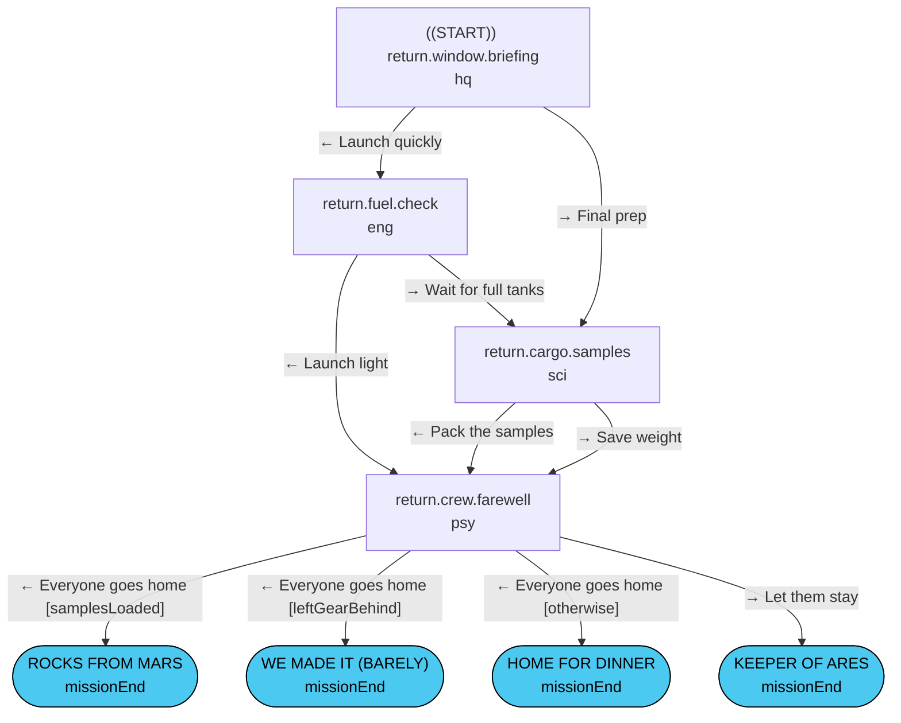

# Return Window (`mars-epilogue-return-window`)

> Decide how the first Mars crew goes home.

Worlds: mars

```mermaid
flowchart TD
  n_return_cargo_samples["return.cargo.samples<br/>sci"]
  n_return_crew_farewell["return.crew.farewell<br/>psy"]
  n_return_fuel_check["return.fuel.check<br/>eng"]
  n_return_window_briefing["((START)) return.window.briefing<br/>hq"]
  n_return_home(["HOME FOR DINNER<br/>missionEnd"]):::mission
  n_return_samples(["ROCKS FROM MARS<br/>missionEnd"]):::mission
  n_return_scrape(["WE MADE IT (BARELY)<br/>missionEnd"]):::mission
  n_return_keeper(["KEEPER OF ARES<br/>missionEnd"]):::mission
  n_return_cargo_samples -->|"← Pack the samples"| n_return_crew_farewell
  n_return_cargo_samples -->|"→ Save weight"| n_return_crew_farewell
  n_return_crew_farewell -->|"← Everyone goes home [samplesLoaded]"| n_return_samples
  n_return_crew_farewell -->|"← Everyone goes home [leftGearBehind]"| n_return_scrape
  n_return_crew_farewell -->|"← Everyone goes home [otherwise]"| n_return_home
  n_return_crew_farewell -->|"→ Let them stay"| n_return_keeper
  n_return_fuel_check -->|"← Launch light"| n_return_crew_farewell
  n_return_fuel_check -->|"→ Wait for full tanks"| n_return_cargo_samples
  n_return_window_briefing -->|"← Launch quickly"| n_return_fuel_check
  n_return_window_briefing -->|"→ Final prep"| n_return_cargo_samples
  classDef advance fill:#7ae582,stroke:#000,color:#000;
  classDef retry fill:#ffb020,stroke:#000,color:#000;
  classDef mission fill:#4cc9f0,stroke:#000,color:#000;
```
