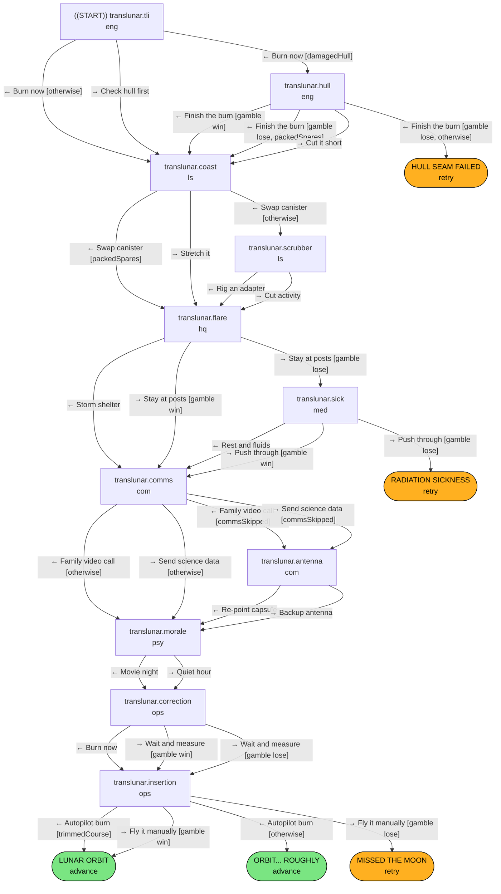

# Translunar (`moon-ch1-translunar`)

> Fly the crew safely to lunar orbit.

Worlds: moon

```mermaid
flowchart TD
  n_translunar_tli["((START)) translunar.tli<br/>eng"]
  n_translunar_hull["translunar.hull<br/>eng"]
  n_translunar_coast["translunar.coast<br/>ls"]
  n_translunar_scrubber["translunar.scrubber<br/>ls"]
  n_translunar_comms["translunar.comms<br/>com"]
  n_translunar_antenna["translunar.antenna<br/>com"]
  n_translunar_morale["translunar.morale<br/>psy"]
  n_translunar_correction["translunar.correction<br/>ops"]
  n_translunar_insertion["translunar.insertion<br/>ops"]
  n_translunar_flare["translunar.flare<br/>hq"]
  n_translunar_sick["translunar.sick<br/>med"]
  n_translunar_orbit(["LUNAR ORBIT<br/>advance"]):::advance
  n_translunar_orbitRough(["ORBIT... ROUGHLY<br/>advance"]):::advance
  n_translunar_flyby(["MISSED THE MOON<br/>retry"]):::retry
  n_translunar_radiation(["RADIATION SICKNESS<br/>retry"]):::retry
  n_translunar_hullBreach(["HULL SEAM FAILED<br/>retry"]):::retry
  n_translunar_tli -->|"← Burn now [damagedHull]"| n_translunar_hull
  n_translunar_tli -->|"← Burn now [otherwise]"| n_translunar_coast
  n_translunar_tli -->|"→ Check hull first"| n_translunar_coast
  n_translunar_hull -->|"← Finish the burn [gamble win]"| n_translunar_coast
  n_translunar_hull -->|"← Finish the burn [gamble lose, packedSpares]"| n_translunar_coast
  n_translunar_hull -->|"← Finish the burn [gamble lose, otherwise]"| n_translunar_hullBreach
  n_translunar_hull -->|"→ Cut it short"| n_translunar_coast
  n_translunar_coast -->|"← Swap canister [packedSpares]"| n_translunar_flare
  n_translunar_coast -->|"← Swap canister [otherwise]"| n_translunar_scrubber
  n_translunar_coast -->|"→ Stretch it"| n_translunar_flare
  n_translunar_scrubber -->|"← Rig an adapter"| n_translunar_flare
  n_translunar_scrubber -->|"→ Cut activity"| n_translunar_flare
  n_translunar_comms -->|"← Family video call [commsSkipped]"| n_translunar_antenna
  n_translunar_comms -->|"← Family video call [otherwise]"| n_translunar_morale
  n_translunar_comms -->|"→ Send science data [commsSkipped]"| n_translunar_antenna
  n_translunar_comms -->|"→ Send science data [otherwise]"| n_translunar_morale
  n_translunar_antenna -->|"← Re-point capsule"| n_translunar_morale
  n_translunar_antenna -->|"→ Backup antenna"| n_translunar_morale
  n_translunar_morale -->|"← Movie night"| n_translunar_correction
  n_translunar_morale -->|"→ Quiet hour"| n_translunar_correction
  n_translunar_correction -->|"← Burn now"| n_translunar_insertion
  n_translunar_correction -->|"→ Wait and measure [gamble win]"| n_translunar_insertion
  n_translunar_correction -->|"→ Wait and measure [gamble lose]"| n_translunar_insertion
  n_translunar_insertion -->|"← Autopilot burn [trimmedCourse]"| n_translunar_orbit
  n_translunar_insertion -->|"← Autopilot burn [otherwise]"| n_translunar_orbitRough
  n_translunar_insertion -->|"→ Fly it manually [gamble win]"| n_translunar_orbit
  n_translunar_insertion -->|"→ Fly it manually [gamble lose]"| n_translunar_flyby
  n_translunar_flare -->|"← Storm shelter"| n_translunar_comms
  n_translunar_flare -->|"→ Stay at posts [gamble win]"| n_translunar_comms
  n_translunar_flare -->|"→ Stay at posts [gamble lose]"| n_translunar_sick
  n_translunar_sick -->|"← Rest and fluids"| n_translunar_comms
  n_translunar_sick -->|"→ Push through [gamble win]"| n_translunar_comms
  n_translunar_sick -->|"→ Push through [gamble lose]"| n_translunar_radiation
  classDef advance fill:#7ae582,stroke:#000,color:#000;
  classDef retry fill:#ffb020,stroke:#000,color:#000;
  classDef mission fill:#4cc9f0,stroke:#000,color:#000;
```
