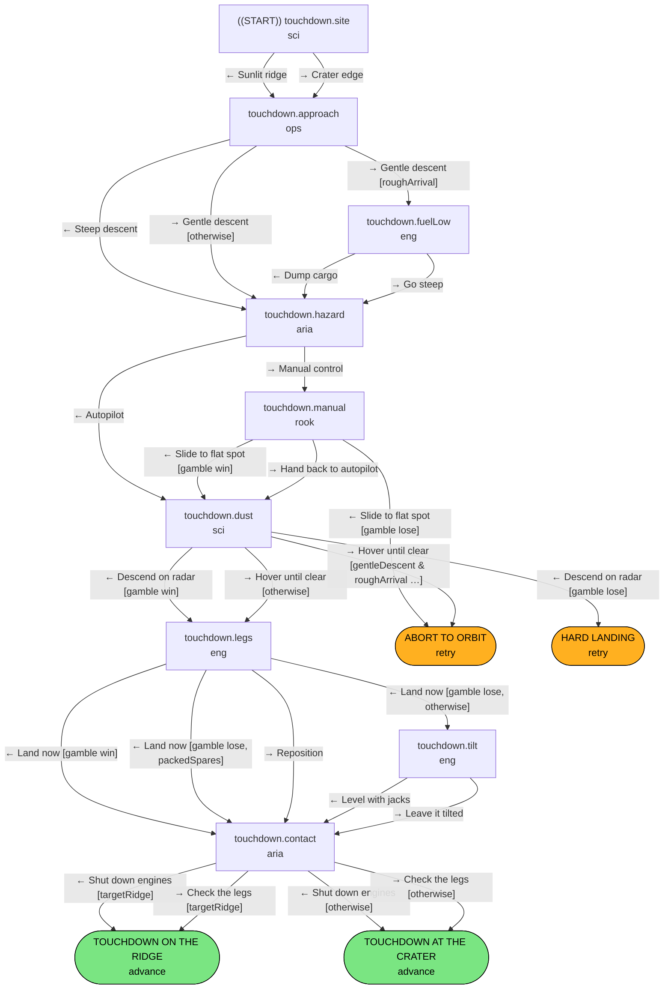

# Touchdown (`moon-ch2-touchdown`)

> Land safely near the lunar south pole.

Worlds: moon

```mermaid
flowchart TD
  n_touchdown_hazard["touchdown.hazard<br/>aria"]
  n_touchdown_manual["touchdown.manual<br/>rook"]
  n_touchdown_dust["touchdown.dust<br/>sci"]
  n_touchdown_legs["touchdown.legs<br/>eng"]
  n_touchdown_tilt["touchdown.tilt<br/>eng"]
  n_touchdown_contact["touchdown.contact<br/>aria"]
  n_touchdown_site["((START)) touchdown.site<br/>sci"]
  n_touchdown_approach["touchdown.approach<br/>ops"]
  n_touchdown_fuelLow["touchdown.fuelLow<br/>eng"]
  n_touchdown_ridge(["TOUCHDOWN ON THE RIDGE<br/>advance"]):::advance
  n_touchdown_craterEdge(["TOUCHDOWN AT THE CRATER<br/>advance"]):::advance
  n_touchdown_abort(["ABORT TO ORBIT<br/>retry"]):::retry
  n_touchdown_crash(["HARD LANDING<br/>retry"]):::retry
  n_touchdown_hazard -->|"← Autopilot"| n_touchdown_dust
  n_touchdown_hazard -->|"→ Manual control"| n_touchdown_manual
  n_touchdown_manual -->|"← Slide to flat spot [gamble win]"| n_touchdown_dust
  n_touchdown_manual -->|"← Slide to flat spot [gamble lose]"| n_touchdown_abort
  n_touchdown_manual -->|"→ Hand back to autopilot"| n_touchdown_dust
  n_touchdown_dust -->|"← Descend on radar [gamble win]"| n_touchdown_legs
  n_touchdown_dust -->|"← Descend on radar [gamble lose]"| n_touchdown_crash
  n_touchdown_dust -->|"→ Hover until clear [gentleDescent & roughArrival …]"| n_touchdown_abort
  n_touchdown_dust -->|"→ Hover until clear [otherwise]"| n_touchdown_legs
  n_touchdown_legs -->|"← Land now [gamble win]"| n_touchdown_contact
  n_touchdown_legs -->|"← Land now [gamble lose, packedSpares]"| n_touchdown_contact
  n_touchdown_legs -->|"← Land now [gamble lose, otherwise]"| n_touchdown_tilt
  n_touchdown_legs -->|"→ Reposition"| n_touchdown_contact
  n_touchdown_tilt -->|"← Level with jacks"| n_touchdown_contact
  n_touchdown_tilt -->|"→ Leave it tilted"| n_touchdown_contact
  n_touchdown_contact -->|"← Shut down engines [targetRidge]"| n_touchdown_ridge
  n_touchdown_contact -->|"← Shut down engines [otherwise]"| n_touchdown_craterEdge
  n_touchdown_contact -->|"→ Check the legs [targetRidge]"| n_touchdown_ridge
  n_touchdown_contact -->|"→ Check the legs [otherwise]"| n_touchdown_craterEdge
  n_touchdown_site -->|"← Sunlit ridge"| n_touchdown_approach
  n_touchdown_site -->|"→ Crater edge"| n_touchdown_approach
  n_touchdown_approach -->|"← Steep descent"| n_touchdown_hazard
  n_touchdown_approach -->|"→ Gentle descent [roughArrival]"| n_touchdown_fuelLow
  n_touchdown_approach -->|"→ Gentle descent [otherwise]"| n_touchdown_hazard
  n_touchdown_fuelLow -->|"← Dump cargo"| n_touchdown_hazard
  n_touchdown_fuelLow -->|"→ Go steep"| n_touchdown_hazard
  classDef advance fill:#7ae582,stroke:#000,color:#000;
  classDef retry fill:#ffb020,stroke:#000,color:#000;
  classDef mission fill:#4cc9f0,stroke:#000,color:#000;
```
