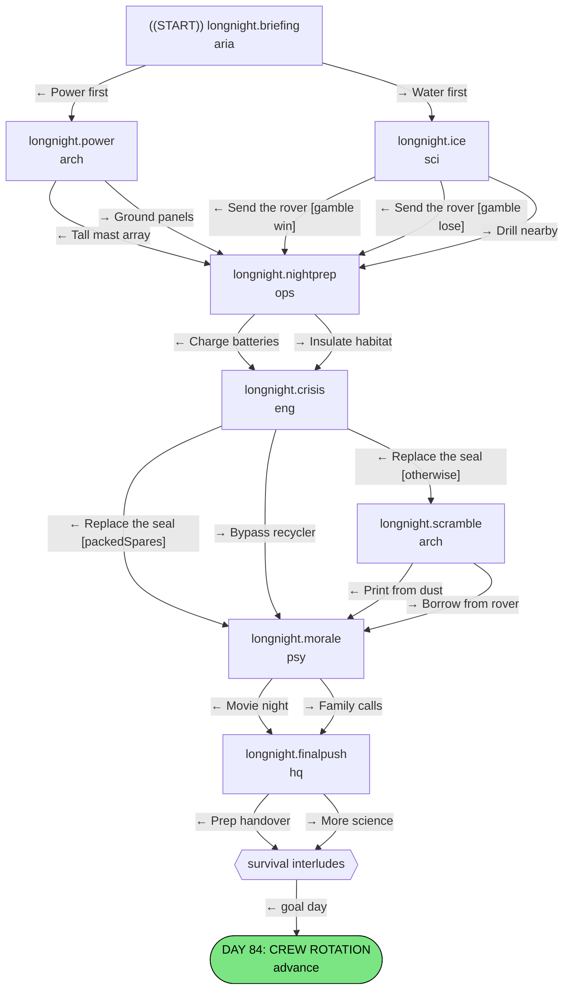

# Long Night (`moon-ch3-long-night`)

> Keep the base alive until the crew rotation on Day 84.

Worlds: moon

```mermaid
flowchart TD
  n_longnight_morale["longnight.morale<br/>psy"]
  n_longnight_finalpush["longnight.finalpush<br/>hq"]
  n_longnight_nightprep["longnight.nightprep<br/>ops"]
  n_longnight_crisis["longnight.crisis<br/>eng"]
  n_longnight_scramble["longnight.scramble<br/>arch"]
  n_longnight_briefing["((START)) longnight.briefing<br/>aria"]
  n_longnight_power["longnight.power<br/>arch"]
  n_longnight_ice["longnight.ice<br/>sci"]
  n_longnight_complete(["DAY 84: CREW ROTATION<br/>advance"]):::advance
  n__interludes{{"survival interludes"}}
  n_longnight_morale -->|"← Movie night"| n_longnight_finalpush
  n_longnight_morale -->|"→ Family calls"| n_longnight_finalpush
  n_longnight_finalpush -->|"← Prep handover"| n__interludes
  n_longnight_finalpush -->|"→ More science"| n__interludes
  n_longnight_nightprep -->|"← Charge batteries"| n_longnight_crisis
  n_longnight_nightprep -->|"→ Insulate habitat"| n_longnight_crisis
  n_longnight_crisis -->|"← Replace the seal [packedSpares]"| n_longnight_morale
  n_longnight_crisis -->|"← Replace the seal [otherwise]"| n_longnight_scramble
  n_longnight_crisis -->|"→ Bypass recycler"| n_longnight_morale
  n_longnight_scramble -->|"← Print from dust"| n_longnight_morale
  n_longnight_scramble -->|"→ Borrow from rover"| n_longnight_morale
  n_longnight_briefing -->|"← Power first"| n_longnight_power
  n_longnight_briefing -->|"→ Water first"| n_longnight_ice
  n_longnight_power -->|"← Tall mast array"| n_longnight_nightprep
  n_longnight_power -->|"→ Ground panels"| n_longnight_nightprep
  n_longnight_ice -->|"← Send the rover [gamble win]"| n_longnight_nightprep
  n_longnight_ice -->|"← Send the rover [gamble lose]"| n_longnight_nightprep
  n_longnight_ice -->|"→ Drill nearby"| n_longnight_nightprep
  n__interludes -->|"← goal day"| n_longnight_complete
  classDef advance fill:#7ae582,stroke:#000,color:#000;
  classDef retry fill:#ffb020,stroke:#000,color:#000;
  classDef mission fill:#4cc9f0,stroke:#000,color:#000;
```
