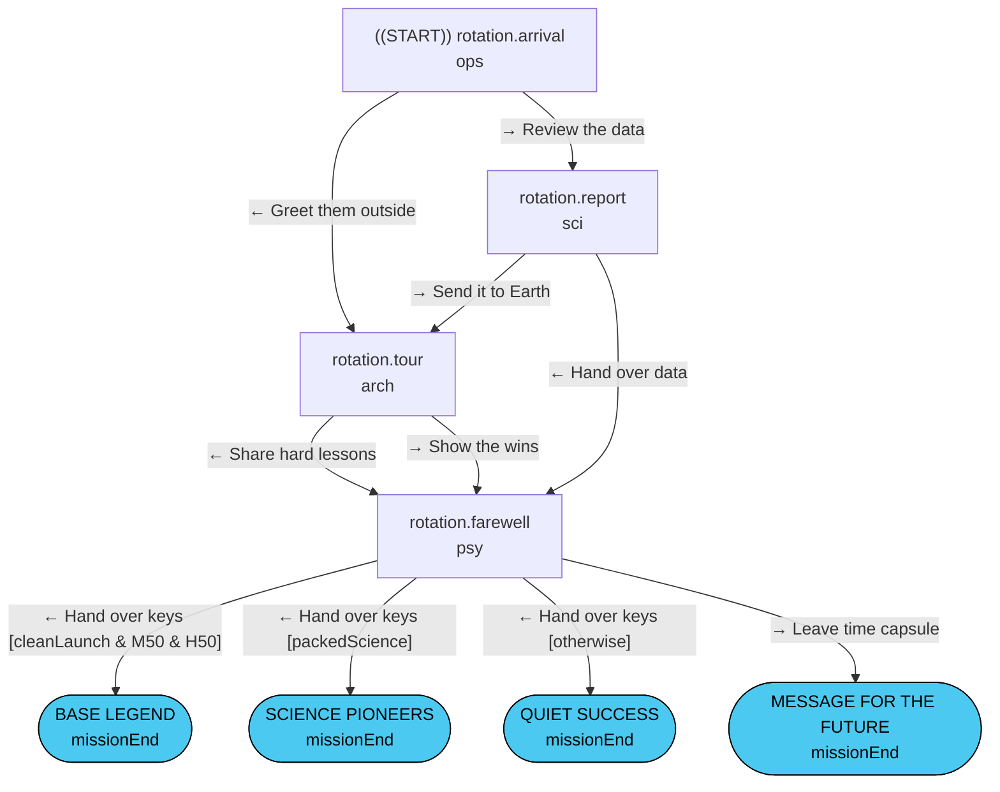

# Crew Rotation (`moon-epilogue-crew-rotation`)

> Hand the base over to the new crew.

Worlds: moon

```mermaid
flowchart TD
  n_rotation_arrival["((START)) rotation.arrival<br/>ops"]
  n_rotation_tour["rotation.tour<br/>arch"]
  n_rotation_report["rotation.report<br/>sci"]
  n_rotation_farewell["rotation.farewell<br/>psy"]
  n_rotation_legend(["BASE LEGEND<br/>missionEnd"]):::mission
  n_rotation_science(["SCIENCE PIONEERS<br/>missionEnd"]):::mission
  n_rotation_legacy(["MESSAGE FOR THE FUTURE<br/>missionEnd"]):::mission
  n_rotation_quiet(["QUIET SUCCESS<br/>missionEnd"]):::mission
  n_rotation_arrival -->|"← Greet them outside"| n_rotation_tour
  n_rotation_arrival -->|"→ Review the data"| n_rotation_report
  n_rotation_tour -->|"← Share hard lessons"| n_rotation_farewell
  n_rotation_tour -->|"→ Show the wins"| n_rotation_farewell
  n_rotation_report -->|"← Hand over data"| n_rotation_farewell
  n_rotation_report -->|"→ Send it to Earth"| n_rotation_tour
  n_rotation_farewell -->|"← Hand over keys [cleanLaunch & M50 & H50]"| n_rotation_legend
  n_rotation_farewell -->|"← Hand over keys [packedScience]"| n_rotation_science
  n_rotation_farewell -->|"← Hand over keys [otherwise]"| n_rotation_quiet
  n_rotation_farewell -->|"→ Leave time capsule"| n_rotation_legacy
  classDef advance fill:#7ae582,stroke:#000,color:#000;
  classDef retry fill:#ffb020,stroke:#000,color:#000;
  classDef mission fill:#4cc9f0,stroke:#000,color:#000;
```
